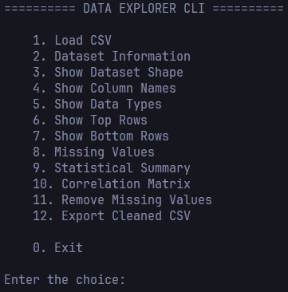

# 📊 Data Explorer CLI

A command-line based Data Explorer built with **Python**, **Pandas**, and **NumPy** that allows users to load, inspect, and analyze CSV datasets efficiently.

This project was built as part of my AI/ML learning journey to strengthen my understanding of Python, Object-Oriented Programming, data manipulation, and software engineering practices.

---

## 🚀 Features

* 📂 Load CSV datasets
* 📋 Display dataset information
* 📏 Show dataset shape (rows & columns)
* 🔍 View top and bottom records
* 📊 Generate statistical summaries
* ❓ Detect missing values
* 🔗 Generate correlation matrix
* 🧹 Remove missing values
* 💾 Export cleaned datasets

---

## 🛠️ Tech Stack

* Python 3.x
* Pandas
* NumPy
* Tabulate

---

## 📁 Project Structure

```text
DataExplorerCLI/
│
├── datasets/
├── exports/
├── explorer.py
├── main.py
├── utils.py
├── requirements.txt
├── README.md
└── .gitignore
```

---

## ⚙️ Installation

Clone the repository:

```bash
git clone https://github.com/tanshu2806/DataExplorerCLI.git
cd DataExplorerCLI
```

Create and activate a virtual environment.

**Windows**

```bash
python -m venv .venv
.venv\Scripts\activate
```

**Linux / macOS**

```bash
python3 -m venv .venv
source .venv/bin/activate
```

Install dependencies:

```bash
pip install -r requirements.txt
```

---

## ▶️ Run the Project

```bash
python main.py
```

---

## Preview



---

## 📚 Learning Objectives

This project focuses on:

* Object-Oriented Programming (OOP)
* File Handling
* Exception Handling
* Command Line Applications
* Data Analysis using Pandas
* Writing clean and maintainable Python code

---

## 🎯 Future Improvements

* Data filtering
* Column search
* Sorting functionality
* Data visualization
* Heatmaps for correlation
* Interactive CLI using Rich/Textual
* Unit tests

---

## 👨‍💻 Author

**Tanshu Tanishk**

Engineering Student | AI & Machine Learning Enthusiast

Currently learning Python, Data Science, Machine Learning, and building projects to prepare for AI/ML internships.
